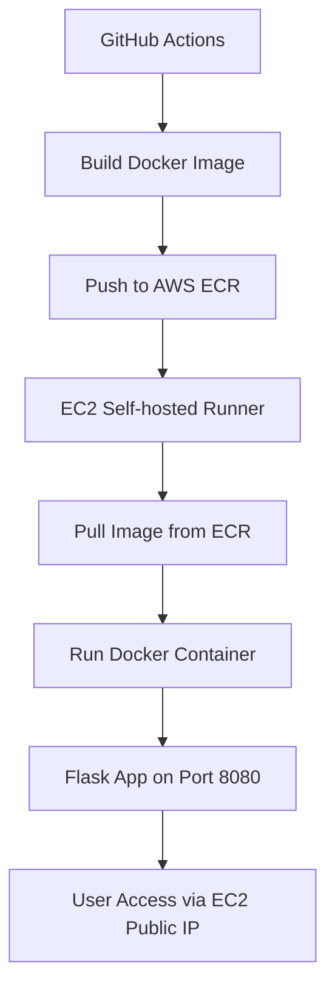
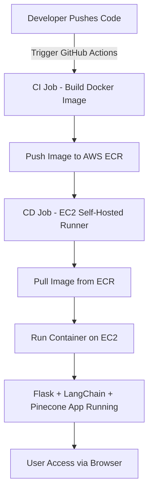

# 🩺 **Medical Chatbot with LLM, LangChain, Pinecone, Flask & AWS CI/CD**

A **Retrieval-Augmented Generation (RAG)**-powered **Medical Chatbot** that can answer medical questions from uploaded PDFs using **LangChain**, **HuggingFace Embeddings**, **Pinecone**, and **OpenAI GPT-4o** — deployed on **AWS EC2** using **Docker** and **GitHub Actions CI/CD**.

---

## 📋 **Table of Contents**

1. [Overview](#overview)
2. [Architecture](#architecture)
3. [Project Folder Structure](#project-folder-structure)
4. [Detailed Code Explanation](#detailed-code-explanation)

   * [helper.py](#1-helperpy)
   * [prompt.py](#2-promptpy)
   * [store_index.py](#3-store_indexpy)
   * [app.py](#4-apppy)
   * [setup.py](#5-setuppy)
   * [template.sh](#6-templatesh)
5. [Frontend Files](#frontend-files)
6. [Docker Setup](#docker-setup)
7. [AWS Setup](#aws-setup)
8. [GitHub Actions CI/CD Explained Step-by-Step](#github-actions-cicd-explained-step-by-step)
9. [Docker Lifecycle in EC2](#docker-lifecycle-in-ec2)
10. [Deployment Workflow Diagram](#deployment-workflow-diagram)
11. [How to Run Locally](#how-to-run-locally)
12. [Troubleshooting](#troubleshooting)

---

## 🧠 **Overview**

This project enables a **medical assistant chatbot** that:

* Extracts text from uploaded **medical PDFs**.
* Converts text into **semantic embeddings** using **HuggingFace**.
* Stores embeddings in **Pinecone** for similarity search.
* Uses **GPT-4o** via LangChain to answer contextually relevant questions.
* Serves a chat interface using **Flask**.
* Deploys automatically to **AWS EC2** through **Docker** and **GitHub Actions**.

---

## 🏗️ **Architecture**

```
User → Flask UI → LangChain RAG Chain → Pinecone (Retrieval) → GPT-4o (Generation)
                              ↑
                              │
                        Embeddings from
                 HuggingFace all-MiniLM-L6-v2
```

---

## 📁 **Project Folder Structure**

```
Medical-Chatbot-with-LLM-Langchain-Pinecone-Flask-and-AWS/
│
├── src/
│   ├── helper.py
│   ├── prompt.py
│   └── __init__.py
│
├── research/
│   └── trials.ipynb
│
├── templates/
│   └── chat.html
│
├── static/
│   └── style.css
│
├── app.py
├── store_index.py
├── requirements.txt
├── setup.py
├── Dockerfile
├── .env
└── .github/workflows/cicd.yaml
```

---

## ⚙️ **Detailed Code Explanation**

---

### 🧩 **1️⃣ helper.py**

Handles data ingestion and preprocessing.

```python
from langchain.document_loaders import PyPDFLoader, DirectoryLoader
from langchain.text_splitter import RecursiveCharacterTextSplitter
from langchain.embeddings import HuggingFaceEmbeddings
from typing import List
from langchain.schema import Document
```

#### **Function 1: Load PDFs**

```python
def load_pdf_file(data):
    loader = DirectoryLoader(data, glob="*.pdf", loader_cls=PyPDFLoader)
    documents = loader.load()
    return documents
```

➡️ Loads all PDFs and extracts page-level text.

#### **Function 2: Clean Metadata**

```python
def filter_to_minimal_docs(docs: List[Document]) -> List[Document]:
    minimal_docs = []
    for doc in docs:
        src = doc.metadata.get("source")
        minimal_docs.append(Document(page_content=doc.page_content, metadata={"source": src}))
    return minimal_docs
```

➡️ Keeps only file source; removes cluttered metadata.

#### **Function 3: Split Text**

```python
def text_split(extracted_data):
    splitter = RecursiveCharacterTextSplitter(chunk_size=500, chunk_overlap=20)
    return splitter.split_documents(extracted_data)
```

➡️ Breaks long text into overlapping 500-character chunks.

#### **Function 4: Load Embedding Model**

```python
def download_hugging_face_embeddings():
    return HuggingFaceEmbeddings(model_name='sentence-transformers/all-MiniLM-L6-v2')
```

➡️ Loads 384-dimensional embedding model from Hugging Face.

---

### 💬 **2️⃣ prompt.py**

Defines chatbot’s system behavior.

```python
system_prompt = (
    "You are a Medical assistant for question-answering tasks. "
    "Use the following pieces of retrieved context to answer "
    "the question. If you don't know the answer, say that you "
    "don't know. Use three sentences maximum and keep the "
    "answer concise.\n\n{context}"
)
```

➡️ Keeps answers concise and factual using retrieved context.

---

### 🧠 **3️⃣ store_index.py**

Creates and uploads embeddings to Pinecone (run once).

```python
from dotenv import load_dotenv
import os
from src.helper import *
from pinecone import Pinecone, ServerlessSpec 
from langchain_pinecone import PineconeVectorStore

load_dotenv()
```

#### **Step 1: Load Keys**

```python
PINECONE_API_KEY=os.environ.get('PINECONE_API_KEY')
OPENAI_API_KEY=os.environ.get('OPENAI_API_KEY')
```

#### **Step 2: Process PDFs**

```python
extracted_data = load_pdf_file("./data")
filter_data = filter_to_minimal_docs(extracted_data)
text_chunks = text_split(filter_data)
```

#### **Step 3: Create Embeddings & Index**

```python
embeddings = download_hugging_face_embeddings()
pc = Pinecone(api_key=PINECONE_API_KEY)
```

#### **Step 4: Create Index**

```python
if not pc.has_index("medical-chatbot"):
    pc.create_index(name="medical-chatbot", dimension=384, metric="cosine",
                    spec=ServerlessSpec(cloud="aws", region="us-east-1"))
```

#### **Step 5: Upload Chunks**

```python
docsearch = PineconeVectorStore.from_documents(
    documents=text_chunks,
    index_name="medical-chatbot",
    embedding=embeddings
)
```

➡️ Pushes all embeddings into Pinecone.

---

### 💻 **4️⃣ app.py**

Main Flask application.

#### **Imports & Setup**

```python
from flask import Flask, render_template, request
from src.helper import download_hugging_face_embeddings
from langchain_pinecone import PineconeVectorStore
from langchain_openai import ChatOpenAI
from langchain.chains import create_retrieval_chain, create_stuff_documents_chain
from langchain_core.prompts import ChatPromptTemplate
from src.prompt import *
from dotenv import load_dotenv
import os

app = Flask(__name__)
load_dotenv()
```

#### **Load API Keys & Connect Pinecone**

```python
embeddings = download_hugging_face_embeddings()
docsearch = PineconeVectorStore.from_existing_index("medical-chatbot", embedding=embeddings)
retriever = docsearch.as_retriever(search_type="similarity", search_kwargs={"k":3})
```

#### **Create LLM + RAG Chain**

```python
chatModel = ChatOpenAI(model="gpt-4o")
prompt = ChatPromptTemplate.from_messages([("system", system_prompt), ("human", "{input}")])
question_answer_chain = create_stuff_documents_chain(chatModel, prompt)
rag_chain = create_retrieval_chain(retriever, question_answer_chain)
```

#### **Flask Routes**

```python
@app.route("/")
def index():
    return render_template('chat.html')

@app.route("/get", methods=["POST"])
def chat():
    msg = request.form["msg"]
    response = rag_chain.invoke({"input": msg})
    return str(response["answer"])
```

---

### ⚙️ **5️⃣ setup.py**

Used for package installation.

```python
from setuptools import find_packages, setup

setup(
    name="medical_chatbot",
    version="0.1.0",
    author="Balaji S",
    packages=find_packages(),
    install_requires=[]
)
```

---

### 🧰 **6️⃣ template.sh**

Bootstrap script to create folders and base files.

---

## 🎨 **Frontend Files**

* `templates/chat.html`: Chat interface UI
* `static/style.css`: Styling for the chat UI

---

## 🐳 **Docker Setup**

**Dockerfile**

```dockerfile
FROM python:3.10-slim-buster
WORKDIR /app
COPY . /app
RUN pip install -r requirements.txt
CMD ["python3", "app.py"]
```

Build and run locally:

```bash
docker build -t medicalbot .
docker run -p 8080:8080 medicalbot
```

---

## ☁️ **AWS Setup**

### 1️⃣ IAM User

* Create user `github-deployer`
* Attach:

  * `AmazonEC2FullAccess`
  * `AmazonEC2ContainerRegistryFullAccess`

### 2️⃣ ECR Repository

* Create ECR repo: `medicalbot`
* Note URI:
  `315865595366.dkr.ecr.us-east-1.amazonaws.com/medicalbot`

### 3️⃣ EC2 Instance

* Launch Ubuntu instance
* Allow inbound port `8080`
* Install Docker:

  ```bash
  curl -fsSL https://get.docker.com -o get-docker.sh
  sudo sh get-docker.sh
  sudo usermod -aG docker ubuntu
  newgrp docker
  ```

### 4️⃣ Self-hosted Runner

GitHub → Settings → Actions → Runners → Add Runner (Linux)
Run provided commands inside EC2.

### 5️⃣ GitHub Secrets

```
AWS_ACCESS_KEY_ID
AWS_SECRET_ACCESS_KEY
AWS_DEFAULT_REGION
ECR_REPO
PINECONE_API_KEY
OPENAI_API_KEY
```

---

## ⚙️ **GitHub Actions CI/CD Explained Step-by-Step**

Workflow file: `.github/workflows/cicd.yaml`

### 🔹 **Trigger**

```yaml
on:
  push:
    branches: [main]
```

➡️ Runs automatically when you push to `main`.

### 🔹 **Job 1: Continuous Integration**

* Builds Docker image
* Pushes it to AWS ECR

### 🔹 **Job 2: Continuous Deployment**

* Runs on EC2 (self-hosted runner)
* Pulls image from ECR
* Runs container with secrets

### 🧠 **Real-World Analogy**

| Step                              | Real-world action                    |
| --------------------------------- | ------------------------------------ |
| You push code                     | GitHub detects change                |
| GitHub runner builds Docker image | Like a chef baking a new recipe      |
| Image pushed to ECR               | Stored in AWS registry (recipe book) |
| EC2 pulls image                   | Kitchen receives new recipe          |
| EC2 runs container                | Chef serves new dish instantly       |

---

## 🐳 **Docker Lifecycle in EC2**



✅ Flask runs inside Docker
✅ Docker maps EC2:8080 → Container:8080
✅ You access at `http://<EC2-IP>:8080`

---

## 🔄 **Deployment Workflow Diagram**



---

## 💻 **How to Run Locally**

```bash
conda create -n medibot python=3.10 -y
conda activate medibot
pip install -r requirements.txt
python store_index.py   # create embeddings
python app.py           # run Flask app
```

Then visit:

```
http://localhost:8080
```

---

## 🩺 **Troubleshooting**

| Issue                           | Cause                    | Fix                                               |
| ------------------------------- | ------------------------ | ------------------------------------------------- |
| `Port 8080 already in use`      | Old Flask/Docker process | `sudo lsof -i :8080` → `kill -9 <pid>`            |
| `Authentication failed for ECR` | Expired credentials      | Re-login to ECR: `aws ecr get-login-password ...` |
| `Container not starting`        | Missing env vars         | Add all required API keys in GitHub Secrets       |
| `Numpy not available`           | Missing dependency       | `pip install numpy torch` inside env              |
| `App not reachable`             | Security group closed    | Allow inbound TCP 8080 in EC2 security settings   |

---

## 🧠 **Summary**

| Component          | Purpose                                |
| ------------------ | -------------------------------------- |
| **LangChain**      | Framework to connect LLMs + Vector DBs |
| **Pinecone**       | Vector storage for embeddings          |
| **HuggingFace**    | Embedding model (384 dimensions)       |
| **Flask**          | Web server + Chat UI                   |
| **Docker**         | Containerized app for portability      |
| **GitHub Actions** | Automates build + deploy               |
| **AWS ECR + EC2**  | Cloud storage and runtime host         |

---

## ✨ **End-to-End Lifecycle**

```
Push Code → GitHub CI Builds Image → Push to ECR
→ EC2 Runner Pulls Image → Docker Runs Flask App
→ Pinecone Retrieval + GPT-4o Generation
→ Chatbot Live on AWS!
```
